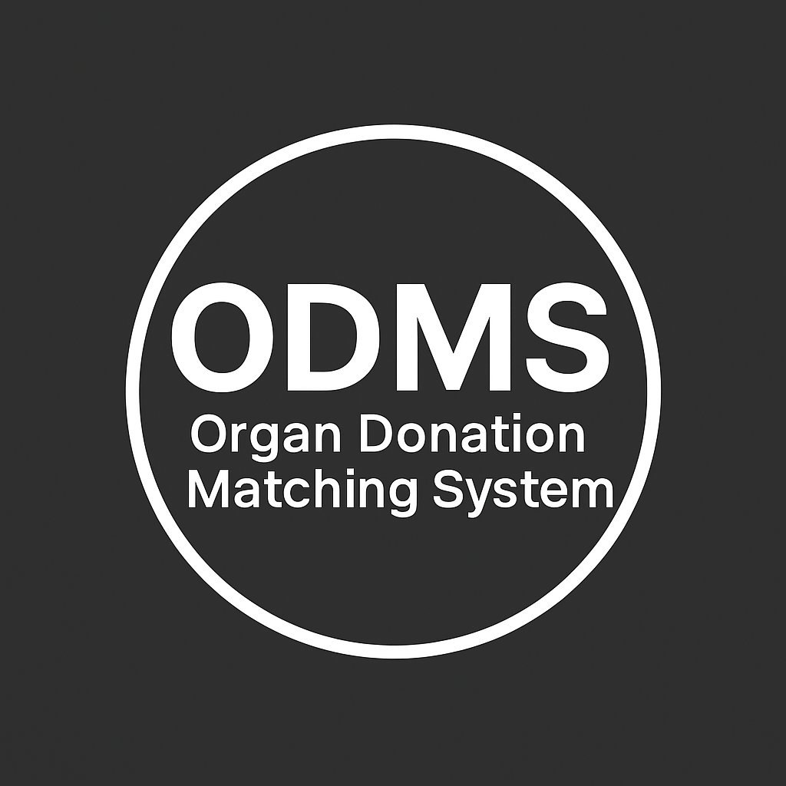

# Organ-Donation-Matching-System
A Python + MySQL based organ donation and matching management system.

* Organ Donation Requesting & Matching System (ODMS)

A Python + MySQL based console application for managing organ donors, recipients, hospital-wise organ requests, and automated organ matching.

This project is ideal for academic submissions, internships, and portfolio showcasing.

---

  

## 📊 System Flowchart

## 📸 Program Output Screenshots
[Outputs](Outputs_ODMS_Screenshots.pdf)

---

📌 Project Overview

The Organ Donation Matching System (ODMS) is designed to assist:

- 🏥 Hospitals
- 🩸 Donors
- ❤️ Recipients

by simplifying:

✔ Donor registration
✔ Recipient registration
✔ Hospital-wise organ requesting
✔ Automated organ matching based on blood group + organ type
✔ Dynamic table creation per hospital

---

⭐ Key Features

🧑‍⚕️ Donor Module

- Register donors with personal details, blood group, organ type, age, and contact.
- Store records inside hospital-specific donor tables.

🧑‍⚕️ Recipient Module

- Register patients requiring an organ.
- Validate data before submitting requests.

🔄 Organ Matching System

Automatically checks for a compatible donor based on:

- Blood group compatibility
- Organ type match
- Donor availability

Displays a simulated notification when a match is found.

🏥 Hospital-Wise Data Separation

Each hospital automatically gets its own tables:

donors_<hospital>
recipients_<hospital>
requests_<hospital>
confirmation_<hospital>

This ensures clean, isolated data for each hospital.

---

🛠 Tech Stack

Component| Technology
Backend| Python 3
Database| MySQL
Connector| mysql.connector
Platform| Console Application

---

📂 Project Structure

Organ-Donation-Requesting-Software/
│
├── Organ-Donation.py        # Main Python Program
├── ODMS.sql                 # SQL database & table script
├── Outputs_ODMS_Screenshots.pdf
├── Flow Chart.png
└── README.md                # Documentation

---

▶ How to Run the Project

1️⃣ Install Dependencies

Install MySQL connector:

pip install mysql-connector-python

---

2️⃣ Import SQL Database

Open MySQL and run:

source ODMS.sql;

This will create:

- Database: ODMS
- Required global tables

---

3️⃣ Configure MySQL Login

Inside Organ-Donation.py, update:

x = ms.connect(
    host="localhost",
    username="root",
    password="yourpassword",
    database="ODMS"
)

---

4️⃣ Run the Program

python Organ-Donation.py

---

📝 Sample Output (Preview)

-----------------------------------------
      ORGAN DONATION MATCHING SYSTEM
-----------------------------------------

1. Donor Registration  
2. Recipient Registration  
3. Organ Request  
4. Match Organ  
5. Exit  
Enter your choice:

---

🗄 Database Summary

Global Tables

- HOSPITALS
- REQUESTS
- CONFIRMATION

Per-Hospital Tables

- donors_<hospital>
- recipients_<hospital>
- requests_<hospital>
- confirmation_<hospital>

---

🎯 Purpose of the Project

This project is ideal for:

- 🎓 College academic submissions
- 🏥 Real-world hospital workflow simulation
- 💼 Internship portfolio showcasing
- 🐍 Beginners learning Python + MySQL

---

👩‍💻 Developer

Sijenna J

Python & MySQL Developer
Sathyabama University

---

⭐ Support

If you find this project useful, give it a star ⭐ on GitHub!

